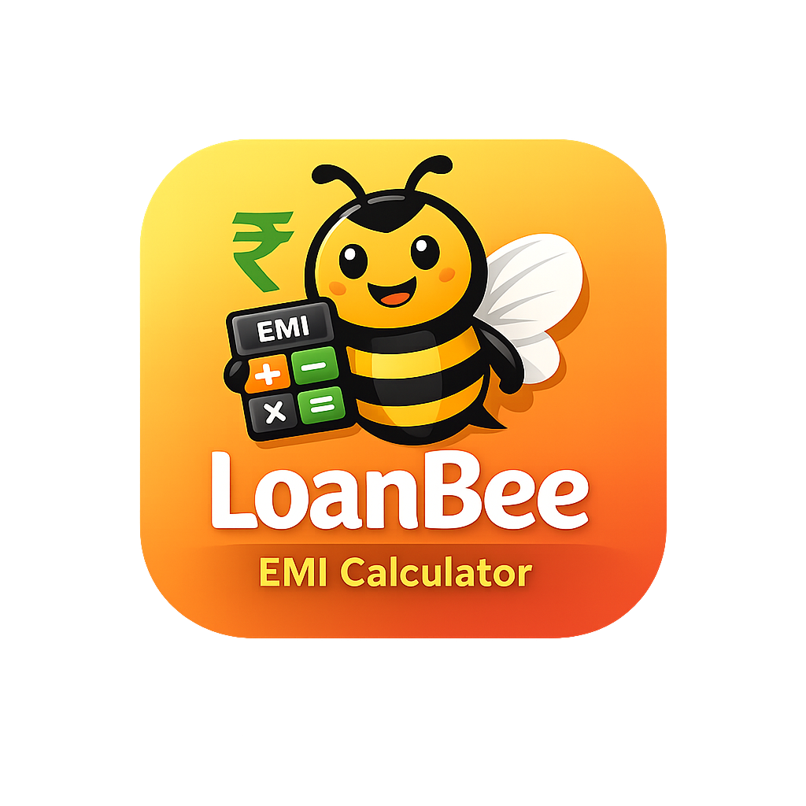

# 🐝 LoanBee - Financial Calculators



LoanBee is a comprehensive financial calculator app built with Flutter. It helps users make informed financial decisions with easy-to-use calculators for loans, investments, taxes, and more.

## ✨ Features

- ✅ **EMI Calculator** - Calculate monthly loan payments with detailed breakdowns
- ✅ **Loan Eligibility** - Check how much loan you qualify for based on your income
- ✅ **SIP Calculator** - Plan your mutual fund investments with SIP returns
- ✅ **FD/RD Calculator** - Calculate fixed deposit and recurring deposit maturity amounts
- ✅ **GST Calculator** - Calculate GST, CGST, and SGST on any amount
- ✅ **Currency Converter** - Convert between 10+ major currencies with real-time rates
- ✅ **Amortization Schedule** - View detailed payment schedule for loans
- ✅ **Dark Mode** - Toggle between light and dark themes

## 🎨 Design

- Beautiful bee-themed UI with orange/yellow gradient
- Responsive card-based layout
- Interactive charts using fl_chart
- Google Fonts (Poppins) for modern typography
- Material 3 design system

## 🚀 Getting Started

### Prerequisites

- Flutter SDK (^3.10.4)
- Dart SDK
- Android Studio / VS Code
- iOS/Android device or emulator

### Installation

1. Clone the repository:
```bash
git clone https://github.com/yourusername/loanbee.git
cd loanbee
```

2. Install dependencies:
```bash
flutter pub get
```

3. Run the app:
```bash
flutter run
```

## 📱 Screenshots

[Add screenshots here]

## 🛠️ Built With

- **Flutter** - UI framework
- **Provider** - State management
- **fl_chart** - Chart visualizations
- **Google Fonts** - Typography
- **intl** - Number formatting and localization
- **http** - Currency API calls
- **shared_preferences** - Local data persistence

## 📁 Project Structure

```
lib/
├── main.dart              # App entry point
├── controllers/           # State management
│   └── theme_controller.dart
├── models/               # Data models
│   └── calculator_models.dart
├── services/             # Business logic
│   ├── calculator_service.dart
│   └── currency_service.dart
├── themes/               # App themes
│   └── app_theme.dart
├── screens/              # UI screens
│   ├── home_page.dart
│   ├── emi_calculator_screen.dart
│   ├── loan_eligibility_screen.dart
│   ├── sip_calculator_screen.dart
│   ├── fd_rd_calculator_screen.dart
│   ├── gst_calculator_screen.dart
│   ├── currency_converter_screen.dart
│   └── amortization_screen.dart
└── widgets/              # Reusable widgets
    └── common_widgets.dart
```

## 🤝 Contributing

Contributions are welcome! Please feel free to submit a Pull Request.

## 📄 License

This project is licensed under the MIT License - see the LICENSE file for details.

## 👨‍💻 Developer

Made with ❤️ by UK Solutions

## 🐛 Found a Bug?

Please open an issue on GitHub with details about the bug and steps to reproduce it.

## ⭐ Show Your Support

Give a ⭐️ if this project helped you!
